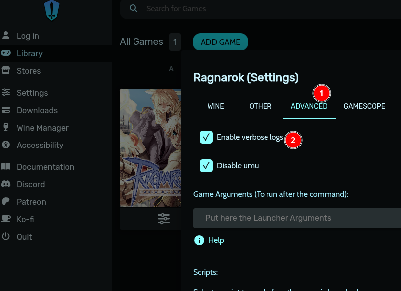
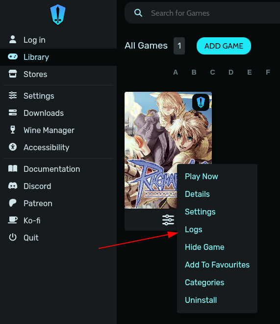
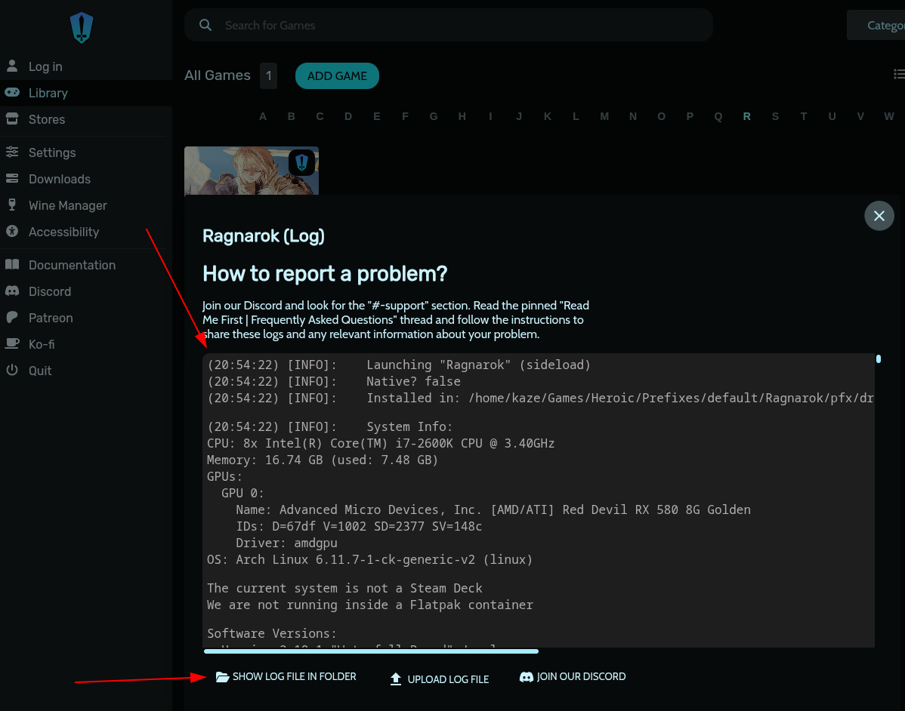

# 🎮 How to Install Ragnarok LATAM on Linux via Proton (using Heroic)

If you want to run **Ragnarok LATAM** on Linux, you can do so perfectly with **Heroic Games Launcher** and **Proton GE**. This step-by-step guide has been tested and works — all thanks to **aleex5**, who discovered this method and shared it with the community.

---

# 🛡️ Heroic

## ✅ Prerequisites

- **Heroic Games Launcher** installed  
  <details>
    <summary>Click to see how to install</summary>

    If you don't have Flatpak installed yet:

    ```bash
    sudo apt install flatpak
    ```

    Add the Flathub repository:

    ```bash
    flatpak remote-add --if-not-exists flathub https://flathub.org/repo/flathub.flatpakrepo
    ```

    Install Heroic:

    ```bash
    flatpak install flathub com.heroicgameslauncher.hgl
    ```

    <div style="background-color:rgba(0, 0, 0, 0.2); border-left: 4px solid #ffcc00; padding: 10px; margin-top: 10px; font-style: italic;">
    The Flatpak version of Heroic Games Launcher is preferable as it ensures quicker updates, better permission control, and superior performance compared to APT or Snap, which may ship outdated versions or carry extra overhead. Also, being the “official” way, it's the one recommended by the developers themselves.
    </div>
  </details>

- **Proton GE** (Proton GloriousEggroll)

## 📥 Installing Proton GE in Heroic

Video showing the step-by-step process (video made by **@aleex5**):

<iframe width="560" height="315" src="https://www.youtube.com/embed/Ql7UkR5zafo" 
frameborder="0" allowfullscreen></iframe>

On Steam (video made by **@aleex5**):

<iframe width="560" height="315" src="https://www.youtube.com/embed/Hy9xlsvKRco" 
frameborder="0" allowfullscreen></iframe>

1. Open **Heroic Games Launcher**  
2. Go to `Settings` → `Wine Manager`

   

3. In the **Proton-GE** tab, download **GE-Proton9-27**  
   (Newer versions may also work)

   

## 🎮 Installing Ragnarok in Heroic

1. In Heroic, click **ADD GAME**

   

2. Fill in the **Game/App Name** field with **Ragnarok**  
   (Heroic will auto-load the image — optional)

   

3. Expand **Show Wine Settings**

   

4. Select **GE-Proton9-27** under **Wine Version**

   

5. Click **Run Installer First**  
   (Important: choose Proton **before** running the `.exe`)

   

6. Select the **Ragnarok LATAM `.exe` installer** you downloaded

   

7. Run the installer as usual

   

8. After installing, locate the game executable:

   

   - Default path:  
     `~/path/to/prefix/Prefixes/default/Ragnarok/pfx/drive_c/Gravity/Ragnarok/Ragnarok.exe`

   

9. Finish setup

## ⚙️ Wine (Proton) Configuration

1. In Heroic, go to the **game settings**

   

2. Click **Wine Config (winecfg)**

   

3. In the **Applications** tab, click **Add application...** and select `Ragexe.exe` from the path `Gravity/Ragnarok/Ragexe.exe`

     
   

4. With `Ragexe.exe` selected, set compatibility mode to **Windows 7**

   

5. Click **Apply** and then **OK**

### 📝 Optional Steps

1. Install Windows fonts via **Winetricks**

   

2. Install the `corefonts` package

   

<div style="background-color:rgba(0, 0, 0, 0.2); border-left: 4px solid #ffcc00; padding: 10px; margin-top: 10px; font-style: italic;">
  <b>🚨 Important:</b>  
  Some people reported that they needed to delete the <b>dbghelp.dll</b> file from the <b>System32</b> folder located at <b>~/path/to/prefix/Prefixes/default/Ragnarok/pfx/drive_c/Windows/System32</b> for the game to run properly. It's worth a try if something isn't working!
</div>

6. In Heroic, go again to the **game settings**

   

7. Go to **Other** and select **Use Steam Runtime**

   

8. Then go to **Advanced** and select **Disable UMU**

   

### 🔧 Workarounds

📹 Video of this part of the tutorial (video made by **@aleex5**):

<iframe width="560" height="315" src="https://www.youtube.com/embed/DQOE8qjO4y0" 
frameborder="0" allowfullscreen></iframe>

On the Nidhogg server, there's an issue where the city **Prontera** becomes inaccessible — you may get the `Disconnected from Server` error when trying to load a character located there. To fix this (and possibly other similar map/server issues), run the following command while the game is running:

```bash
sudo sysctl -w net.ipv4.tcp_timestamps=0
```

If you prefer, you can make this change permanent by editing the `/etc/sysctl.conf` file and adding the line `net.ipv4.tcp_timestamps=0` at the end.

<div style="background-color:rgba(0, 0, 0, 0.2); border-left: 4px solid #ffcc00; padding: 10px; margin-top: 10px; font-style: italic;">
  <b>⚠️ Heads-up:</b>  
  This is still a topic of active discussion in the community, so the best thing for now is to check the Discord server if you have any questions about this step!
</div>

This workaround was discovered by **@trololobr** on Discord!

## 🚀 Running Ragnarok

Now you can launch the game normally from Heroic.  
If everything is set up correctly, Ragnarok will open and run without issues!

## 🔦 Troubleshooting
Checking the log is always recommended, since most of the time the error message (such as “DLL not found”) will appear there, giving you a clear direction to solve the problem. For this reason, it’s important to enable logs while the game is not yet working.

1. Open Settings, go to the Advanced tab, and check **Enable verbose Logs**

   

2. Right-click the game, open the menu, and select **Logs**

   

3. The most recent log will be displayed on screen. You can also open the log folder to view it with any text editor, or check the previous log if needed

   

### **Failed to connect to the Patch server**

- It is very likely that the prefix created by Proton was configured in **32-bit mode**, which can cause issues on some distributions that don’t install the **32-bit (lib32-*)** libraries by default, as is the case with Arch Linux. To fix this error, check if the **32-bit version** of `gnutls` is installed. If not, **you will need to install the `lib32-gnutls` package**. **GnuTLS** is used by the Ragnarök client to download patches via HTTPS.

---

# 🙌 Credits

Special thanks to **@aleex5**, who discovered and shared this setup with the community — helping all the Linux folks relive this classic!
